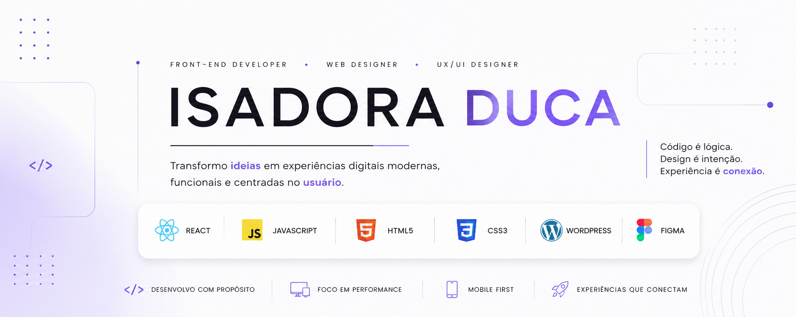

  

<h1 align="center">Olá, eu sou a Isadora! 👋</h1>

  Desenvolvedora Front-End • Web Designer • UX/UI Designer

  Transformo ideias em experiências digitais modernas, acessíveis e focadas em performance.

  

  

  

## Sobre mim

- 💻 Desenvolvedora Front-End com foco em React e JavaScript
- 🎨 Apaixonada por UX/UI e interfaces intuitivas
- 🚀 Experiência com WordPress, Landing Pages, SEO e Performance
- 📚 Estudando Desenvolvimento Full Stack
- 🌎 Barueri • SP

  ## Tecnologias

